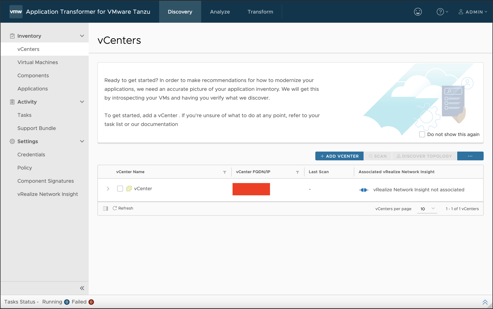
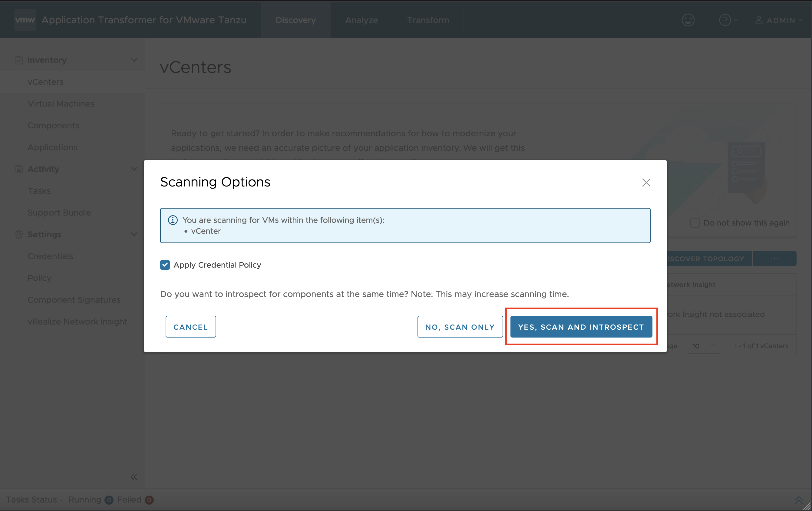
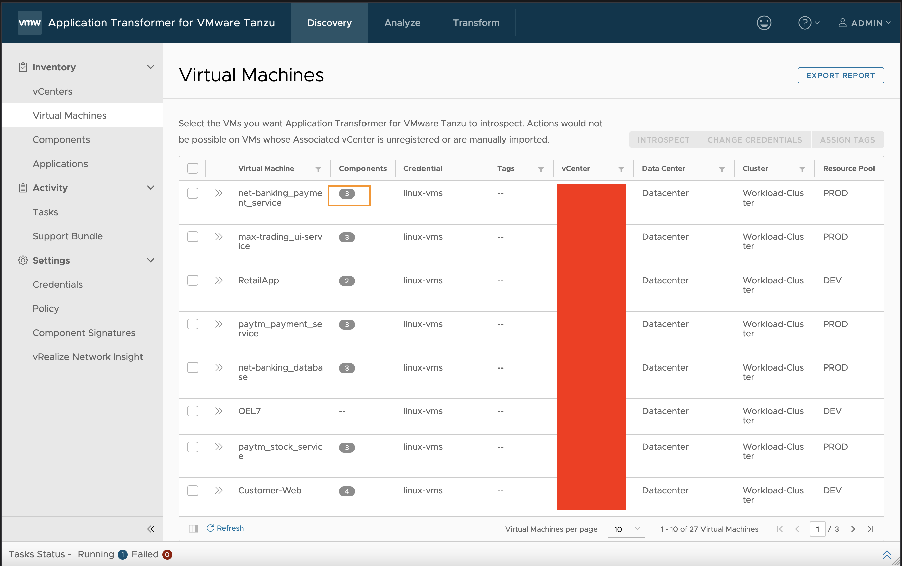
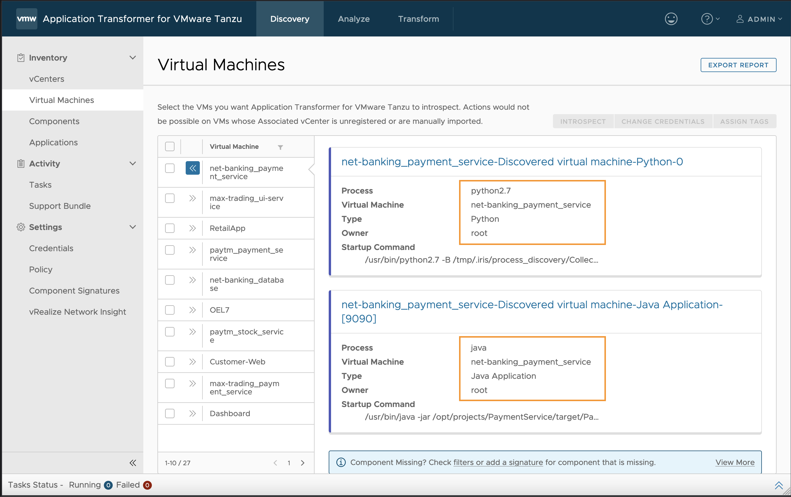
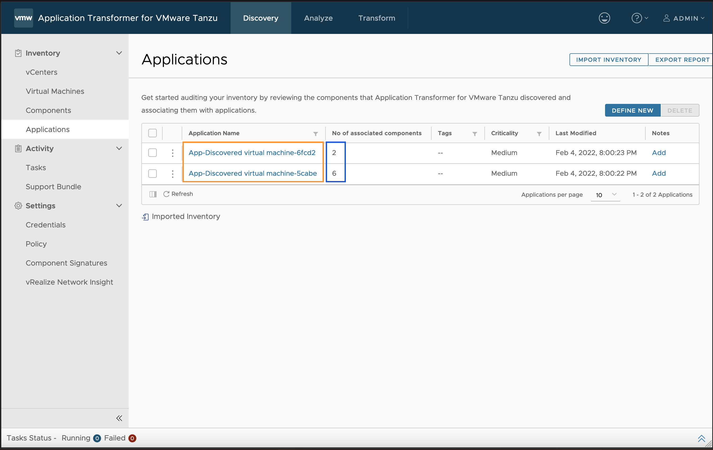
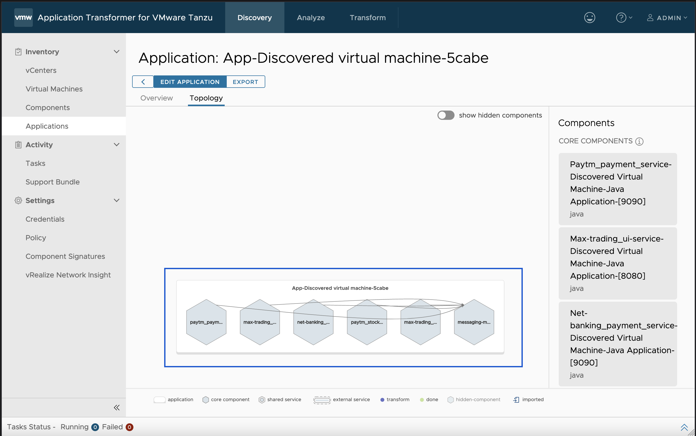

[Application Transformer for VMware Tanzu](https://tanzu.vmware.com/content/blog/application-transformer-for-vmware-tanzu) is a product that helps Infrastructure Adminstrators to learn about the inventory that they are managing on the on-prem infrastructure. 

* The product provides valuable insights on what processes (Components) are running on the virtual machines managed by vCenter
* Using data from vRNI, the tool maps the various components and groups them into logical applications. This provides the administrators a great insight on which VMs are dependent on other VMs, and this would help them plan the move of the applications
* The tool generates clusters of application components, that have similar archetypes. 

For the DevOps team, the tool provides a mechanism to attempt to containerize the workloads that are running on the VMs. This could be the first step in the journey of migrating workloads from VMs to containers.

Lets see the product in action:

* [Download](https://customerconnect.vmware.com/downloads/info/slug/infrastructure_operations_management/application_transformer_for_vmware_tanzu/1_x) the OVA to install on-prem.
* Import the OVA into your vCenter
* Once the setup is complete, access the Application Tranformer using the IP you set during the OVA deployment, or use the one that was assigned by DHCP

* Register the vCenter/s by following the product documentation
  

* Run a scan and introspect on the vCenter, which will then discover the virtual machines managed by the vcenter and also dial into the VMs to identify the running components on it
  

* Once the tasks are triggered you can go to the `Virtual Machines` tab and view all the vms that were discovered during the process
  

* Once the `introspect` task is complete, you will see a badge alongside each vm, which would indicate the number of components that were discovered, using the component signatures catalog
  

* Upon expanding each of the Virtual Machines, you can gather additional insights on the type of the component that was discovered, running ports, etc
  

* At this point once you trigger the discover topology button on vCenter, ATVT would logically group components that are communcating with each other into one Application
  

* The topology can be viewed for each of the application. This provides great validation of the architecture diagram and if this doesn't provide the complete picture, the DevOps team or the Application Teams can choose to refine this manually.
  

There are a lot more aspects that are covered as part of containerization, but I'll cover that in the next blog. 
